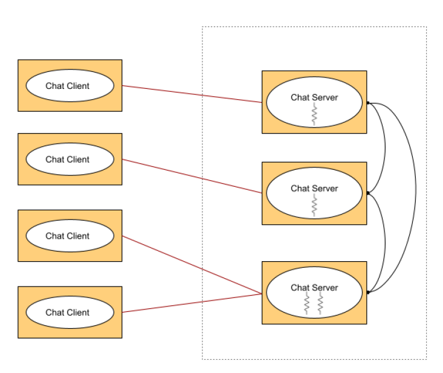

# ChatServer
It is a Distributed Multi-Server Chat System.
This project is all about a distributed chat application in which chat clients can communicate with each other with the help of chat servers. The architecture of the system is as below.

1. Leader selection process - We need a leader server in this distributed chat server system for the maintenance of the same state for all the servers and also the servers need to maintain the uniqueness in the client IDs and Room IDs creation. If any request for room creation / user creation comes to any server, it redirects to the leader server and the ID value is checked atomically. And If the leader accepts the creation request, the value will be sent to all the other servers except the server which requested for the creation. This way the same state is maintained in all servers. If the Leader server goes down, the servers themselves will elect a new leader server using the Fast bully algorithm and the application will continue to run.
2. Heartbeat functionality - Heartbeat implementation is to check if the servers are down or not. All the servers maintain heartbeat from all the servers. A threshold value is used for the alive factor. If the heartbeat value surpasses the value, each server thinks that the other server is down. So it removes all the client IDs and room IDs associated with that server and relays the message to all the servers. So the removed Room IDs and Client IDs can be reusable by the servers again. Alive factor of each individual server is monitored. This is how we have implemented fault tolerance to a certain level.
